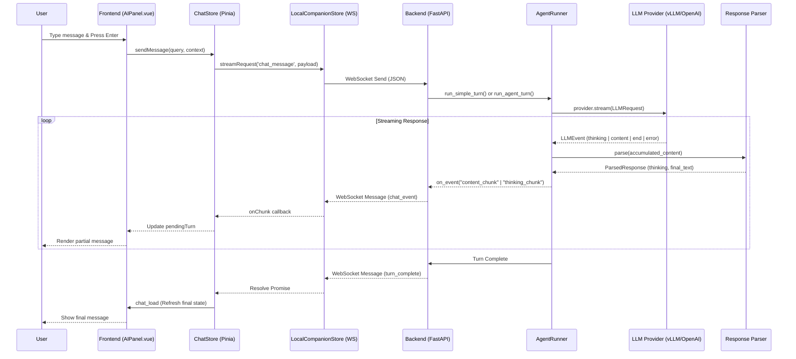

# XEditor Chat Flow Documentation

This document describes the end-to-end flow of a chat message in XEditor, from the user's input in the Vue.js frontend to the backend processing and streaming LLM response.

## Overview Diagram

## Detailed Process

### 1. Frontend Interaction

- **Component**: `client/src/apps/CodeEditor/components/ai/AIPanel/AIPanel.vue`
- **Composable**: `client/src/apps/CodeEditor/components/ai/AIPanel/composables/useChatInput.ts`
- **Action**: When the user clicks send, `sendMessage()` is triggered. It gathers context (active file, selection) using the `ContextManager` and calls the `ChatStore`.

### 2. Communication Layer

- **Store**: `client/src/stores/chat.ts`
- **Transport**: `client/src/stores/localCompanion.ts` (WebSocket)
- **Action**: The `ChatStore` prepares the model configuration and uses `streamRequest` to send a `chat_message` type via the persistent WebSocket connection to the Python backend.

### 3. Backend Entry Point

- **File**: `server/server.py`
- **Action**: The WebSocket listener detects the `chat_message` message type. It starts an asynchronous task (`chat_stream_task`) which routes the request to the `AgentRunner` based on the requested mode (Ask, Agent, Plan).

### 4. Agent Runner Execution

- **File**: `server/agent_runner.py`
- **Functions**: `run_simple_turn` (Ask mode) or `run_agent_turn` (Agent/Plan modes).
- **Process**:
  1. Loads the chat session from `ChatManager`.
  2. Builds the prompt context using `ContextBuilder`.
  3. Resolves the system prompt based on the selected `PromptSet`.
  4. Selects the appropriate `ResponseParser` for the model and mode.
  5. Initiates the LLM streaming request.

### 5. LLM Streaming

- **Package**: `server/providers/`
- **Action**: The `AgentRunner` uses `get_provider(config)` to get the appropriate provider (OpenAI, Gemini, LM Studio, vLLM, etc.) and calls `provider.stream(LLMRequest)`. Each provider normalizes its response into structured `LLMEvent` objects (thinking, content, end, error).
- **Yielding**: Providers yield `LLMEvent` objects as they arrive. The `AgentRunner` handles structured thinking events directly and falls back to parsing `<think>` tags for providers that don't emit structured thinking.

### 6. Incremental Parsing

- **Base Class**: `server/parsers/base.py`
- **Implementation**: e.g., `server/prompt_sets/default/gpt/ask/parser.py`
- **Mechanism**: As chunks accumulate, the runner calls `parser.parse(accumulated_content)`. The parser identifies:
  - `<think>` tags: Extracted for internal reasoning.
  - `<patch>` tags: Identified and eventually converted to markdown diffs.
  - Regular content: Cleaned of internal tags and streamed back to the UI.

### 7. Event Dispatching

- **Callback**: `on_event` in `server/apps/code_editor/agent/agent.py`.
- **Events**:
  - `thinking_start` / `thinking_chunk` / `thinking_end`
  - `content_chunk`
  - `tool_start` / `tool_result` (Agent mode only)
  - `turn_complete` / `error`

### 8. Frontend Rendering

- **Update**: The `onEvent` callback in `useChatInput.ts` updates the `pendingTurn` reactive reference.
- **Component**: `client/src/components/ai/AIPanel/components/ChatMessages.vue` renders the message in real-time as `pendingTurn.assistantMessage` grows.

## Special Features

- **Prompt Sets**: The behavior (prompt and parser) is determined by the `PromptSet` configuration in `server/prompt_sets/`.
- **Harmony Format**: In Agent mode, tools are called using the Harmony format (`<|channel|>...`), which the `HarmonyParser` identifies and extracts for execution.
- **Context Ranking**: Before sending the query, the frontend ranks and limits context items to fit within the model's context window.
